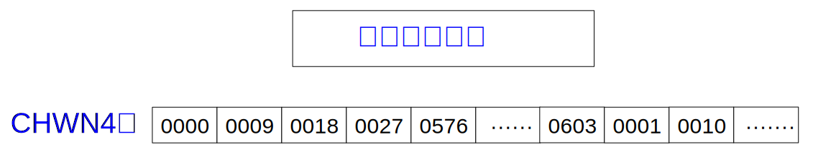

.. _tensor-layout:

===============
Tensor 内存布局
===============
.. warning::

   * 这一部分内容属于底层细节，在绝大多数情景下用户不需要了解这些背后的设计。
     如果你希望成为 MegEngine 的核心开发者，了解底层细节将很有帮助，更多内容请参考开发者指南；
   * 相关的代码实现在： :src:`dnn/include/megdnn/basic_types.h` - ``megdnn::TensorLayout``.

.. seealso::

   NumPy 对 ndarray 内存布局的解释：
   `Internal memory layout of an ndarray
   <https://numpy.org/doc/stable/reference/arrays.ndarray.html#internal-memory-layout-of-an-ndarray>`_

Tensor 值如何存储在内存中
-------------------------

一个 :py:class:`~.Tensor` 类的实例由一维连续的计算机内存段组成。

结合 :ref:`tensor-indexing` 机制，可以将值映射到内存块中对应元素的位置，
而索引可以变化的范围由 Tensor 的 :ref:`形状 <tensor-shape>` 属性指定。
每个元素占用多少个字节以及如何解释这些字节由 Tensor 的 :ref:`数据类型 <tensor-dtype>` 属性指定。

一段内存本质上是连续的，有许多不同的方案可以将 N 维 Tensor 数组的项排列在一维块中。
根据排列顺序的区别，又可以分为行主序和列主序两种风格，下面我们以最简单的 2 维情况进行举例：

.. panels::
   :container: +full-width
   :card:

   .. image:: ../../../_static/images/Row_and_column_major_order.svg 

   上图分别使用行主序和列主序进行索引：

   * 其中 :math:`a_{11} \ldots a_{33}` 代表九个元素各自的值；
   * 偏移量和索引之间有着明显的关系。
   +++
   图片来自 `Row- and column-major order <https://en.wikipedia.org/wiki/Row-_and_column-major_order>`_
   ---
   这个 2 维 Tensor 中的元素实际上可以由一维连续的内存块分别进行映射：

   .. list-table::
      :header-rows: 1

      * - Offset 
        - Access
        - Value
      * - 0
        - a[0][0]
        - a11
      * - 1
        - a[0][1]
        - a12
      * - 2
        - a[0][2]
        - a13
      * - 3
        - a[1][0]
        - a21
      * - 4
        - a[1][1]
        - a22
      * - 5
        - a[1][2]
        - a23
      * - 6
        - a[2][0]
        - a31
      * - 7
        - a[2][1]
        - a32
      * - 8
        - a[2][2]
        - a33

   +++
   这里以 C 风格所用的行主序进行举例。

MegEngine 和 NumPy 一样灵活，支持任何跨步索引方案，这里需要提到一个概念：步幅（Strides）。

.. _tensor-strides:

Tensor 的步幅
-------------

.. seealso::

   NumPy 的 ndarray 具有 :py:attr:`~numpy.ndarray.strides` 属性（MegEngine 中也存在着这一概念，但没有提供接口）。

.. note::

   Tensor 的步幅 ``strides`` 是一个元组，告诉我们遍历 Tensor 元素时要在每个维度中步进（step）的字节数；
   或者可以理解成在某个轴上索引元素时，单位刻度代表的内存范围，
   即必须在内存中跳过多少字节才能沿某个轴移动到下一个位置。
   这个属性通常不需要由用户进行修改。

以 2 维情况为例
~~~~~~~~~~~~~~~

想象有这样一个由 32 位（4 字节）整型元素组成的 Tensor:

>>> x = megengine.tensor([[0, 1, 2, 3, 4],
...                       [5, 6, 7, 8, 9]], dtype="int32")

该 Tensor 中的元素一个接一个地存储在内存中（称为连续内存块），占据 40 个字节。
我们必须跳过 4 个字节才能移动到下一列，但必须跳过 20 个字节才能到达下一行的相同位置。
因此，``x`` 的步幅为 ``(20, 4)``.

我们用 :math:`s^{\text {row }}` 表示行主序得到的步幅，则有 :math:`s_0^{\text {row }} = 4 \times 5 = 20`, :math:`s_1^{\text {row }} = 4`.

借助 :math:`s^{\text {row }}` 来计算，对应地 ``x[1][2]`` （对应值为 :math:`7` ）位置元素的字节偏移量为 :math:`1 \times 20 + 2 \times 4 = 28` .

推广到一般情况
~~~~~~~~~~~~~~

更一般的情况，对于形状为 ``shape`` 的一个 N 维 Tensor, 其步幅 :math:`s^{\text {row }}` 计算公式如下：

.. math::

   s_{k}^{\text {row }}=\text { itemsize } \prod_{j=k+1}^{N-1} d_{j}

其中 :math:`\text {itemsize}` 取决于 ``dtype``, 而 :math:`d_{j}=\text { self.shape }[j]` .

索引为 :math:`T[n_0, n_1, \ldots , n_{N-1}]` 元素的字节偏移量为：

.. math::

    n_{\text {offset }}=\sum_{k=0}^{N-1} s_{k} n_{k}

步幅概念的用途
~~~~~~~~~~~~~~

.. seealso::

   对于一些改变形状的 Tensor 操作，我们可以通过修改步幅来避免实际进行内存的拷贝。

.. _format-introduction:

format介绍
-------------

​在深度学习框架中，如下图所示，通用的神经网络特征图用4维数组组成，然而对于计算机而言，数据的存储只能是线性的，因此不同的数据排布（format）方式，会显著影响计算性能，其中针对GPU的特点，Megengine采用的数据排布方式有：NCHW、NHWC、NCHW4、NCHW32、NCHW64和CHWN4等等。

为更好的说明不同format的具体含义，下图列举了128个tensor的逻辑结构。其中N、H、W和C分别为：

      * N：Batch。表示图片的批次，此处为2；
      * H：Height。表示图片的高，此处为3；
      * W：Weight。表示图片的宽，此处为3；
      * C：Channel。表示图片的通道数，此处为64。

.. figure:: ../../../_static/images/format_logical_construction.svg

NCHW 和 NHWC
~~~~~~~~~~~~~~

(1) **排布方式**

对于计算机而言，数据的存储只能是线性的，其中 NCHW 和 NHWC 最为常用，下图列举了 NCHW 和 NHWC 的物理存储结构：

.. figure:: ../../../_static/images/format_NCHW_NHWC.svg

对于 NCHW 而言，优先存储W维度，之后按照H、C和N分别存储，因此按照顺序从0000一直存储到1151；

对于 NHWC 而言，优先存储C维度，因此优先存储0000、0009一直到1143，之后继续按照W、H和N分别存储，存储0001、0010等；

(2) **特性**

   * 对于"NCHW" 而言，其同一个通道的像素值连续排布，更适合那些需要对 **每个通道单独做运算** 的操作，比如"MaxPooling"。
   * 对于"NHWC"而言，其不同通道中的同一位置元素顺序存储，因此更适合那些需要对 **不同通道的同一像素做某种运算** 的操作，比如“Conv”。

NCHWX
~~~~~~~~~~~~~~
[Batch, Channels/X, Height, Width, X=4，32或64]

(1) **排布方式**

由于典型的卷积神经网络随着层数的增加，其特征图在下采样后的长和宽逐渐减小，
但是channel数随着卷积的filter的个数不断增大是越来越大的，经常会出现channel数为128，256等很深的特征图。
这些很深的特征图与filter数很多的卷积层进行运算的运算量很大。
为了充分利用有限的矩阵计算单元，进行了Channel维度的拆分是很有必要的。Megengine根据不同数据结构特点，分别对Channel维进行了Channel/4，Channel/32和Channel/64的拆分，
下图为NCHWX的物理存储结构。

.. figure:: ../../../_static/images/format_NCHWX.svg

NCHWX最先存储的都是Channel维，不同点在于因为X的不同，优先存储的Channel个数不同，NCHW4 优先存储4个channel维，此处为0000、0009、0018和0027，之后继续按照W、H、C和N进行存，此处继续存0001、0010等；
NCHW32和NCHW64类似，不过优先存储的分别为32个channel和64个channel，之后继续按照W、H、C和N进行存。

(2) **特性**

   * ​更好的适配SIMT，其中NCHW4可以针对int8数据类型，利用CUDA的dp4a模块进行计算，而NCHW32和NCHW64分别针对int8和int4数据类型，更好的利用CUDA的tensorcore计算单元进行计算；
   * 对cache更友好，减少cache miss；
   * 易进行padding，减少边界分支判断，代码逻辑简单。

CHWN4
~~~~~~~~~~~~~~
为了更好的适配cuda的dp4a和tensorcore处理单元，引入了CHWN4。

(1) **排布方式**

CHWN4优先存储Channel维，存储4个数，0000、0009、0018和0027之后，沿着N维，直接存0576到0603，之后在沿W维和H维，存0001和0010等。

(2) **特性**

   * 相较于NCHWX，可以更好的利用dp4a和tensorcore处理单元，不需要layout转换；
   * 此外依然具有对cache友好，及易进行padding的优点。

