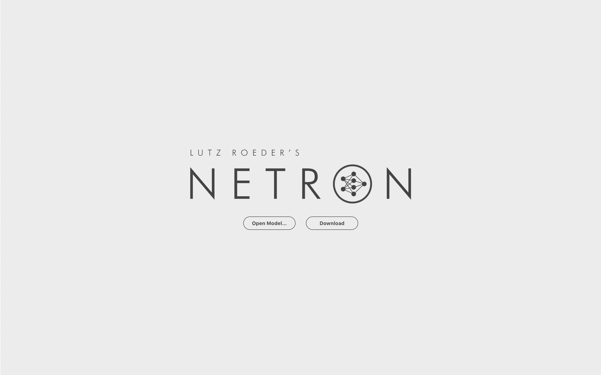
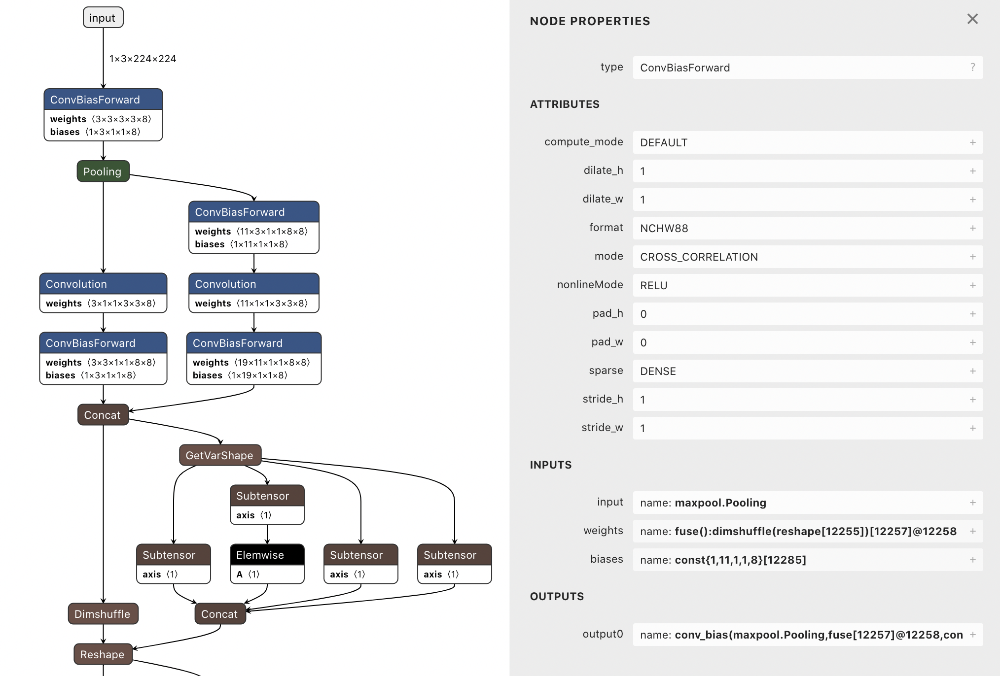
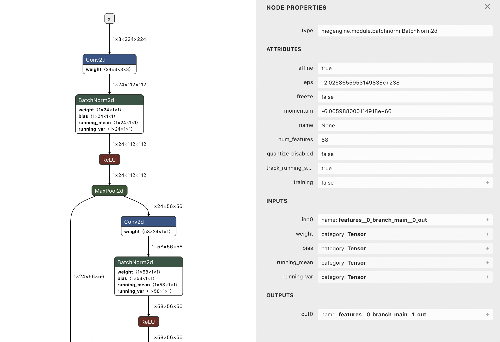

.. _viewmodel:

========================
MegEngine 模型可视化
========================

借助 `Netron平台 <https://github.com/lutzroeder/netron>`_ ，我们可以查看 MegEngine 训练出的模型网络结构。Netron 是一种用于神经网络、深度学习和机器学习模型的可视化工具，它可以在 Linux、Windows 和 Mac 上跨平台运行，并且支持多种框架和格式。在2022年8月，我们将 MegEngine 集成在了此平台上，目前 Netron 已支持 MegEngine 模型的 TracedModule 及 C++ 计算图两种结构：

* TracedModule 格式:

  * Netron 版本：6.0.0 及以上版本，为了保证最优体验效果，Netron 建议使用最新版本
  * 保存 TracedModule 模型文件时需要用 .tm 作为文件后缀，推荐使用 megengine.save 和 megengine.load 保存和加载 TracedModule
  * 因为 tm 格式的模型有很多子 module ，为了让大家更好的了解他们之间的链接关系，所以在做可视化展示时，各子图是全部展开的，以一张图来完整展示模型结构

* C++ 格式:

  * Netron 版本：6.5.3 及以上版本，为了保证最优体验效果，Netron 建议使用最新版本
  * MegEngine 版本：v1.10.0 及以上

使用 Netron 进行 MegEngine 模型可视化
--------------------------------------
.tm 模型获取可参考 `快速上手Traced Module <https://www.megengine.org.cn/doc/stable/zh/user-guide/model-development/traced_module/quick-start.html>`_ , .mge 模型获取可参考 `获得用于 MegEngine Lite 推理的模型 <https://www.megengine.org.cn/doc/stable/zh/user-guide/deployment/lite/get-model.html>`_ 。
以.tm 模型为例，获取到模型后有三种方式可视化此模型。

使用 Netron 客户端
~~~~~~~~~~~~~~~~~~~~~~
以软件的方式安装netron，地址见 `Netron官方github <https://github.com/lutzroeder/netron>`_ ，下载对应mac或windows对应版本的nerton软件，打开软件运行即可； 

命令行调用
~~~~~~~~~~
将 netron 作为 python 库进行安装，在 python 代码调用 netron 库来载入模型进行可视化。可以通过``pip install netron`` 进行安装。
在命令行输入：

.. code-block:: python
    
   netron Filename

点击回车，会生成地址，浏览器打开该地址，就出现我们训练的模型可视图了。

或者新建一个modelView.py文件，代码如下：

.. code-block:: python

   import netron  # 使用netron进行模型可视化 
   modelPath = "./traced_shufflenet.tm"  # 模型的路径
   netron.start(modelPath)  # 启动模型
  
随后运行modelView.py文件，生成地址，浏览器打开该地址，就出现我们训练的模型可视图了。

在线网站
~~~~~~~~~~~~~
如果你既不想安装 netron 软件，也不想安装 netron 库，netron 作者很贴心地做了一个 `在线demo网站 <https://netron.app>`_ ，可以直接上传模型文件查看可视化结果，能够得到完整的模型结构图，并点击查看每层结构的细节参数。

可视化效果
~~~~~~~~~~

这里提供给大家 `示例模型 <https://github.com/lutzroeder/netron/issues/607>`_  供大家练习。

